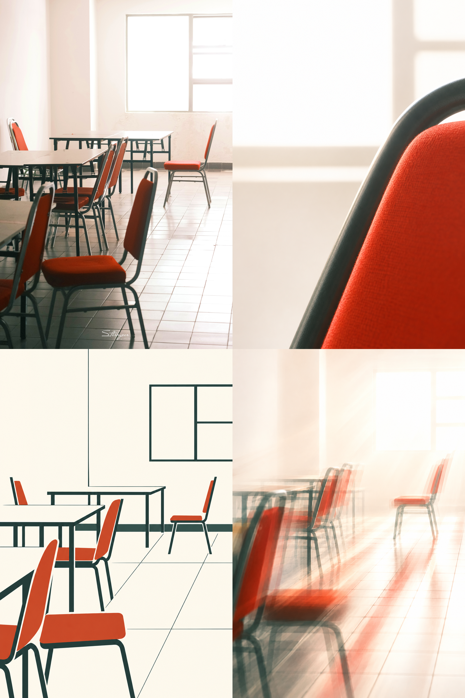
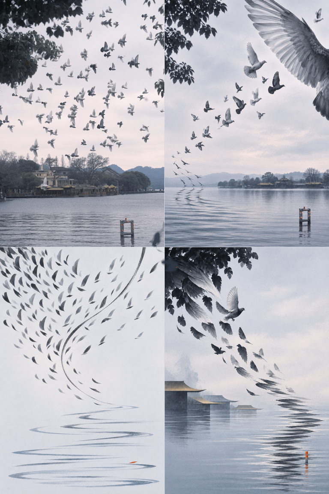
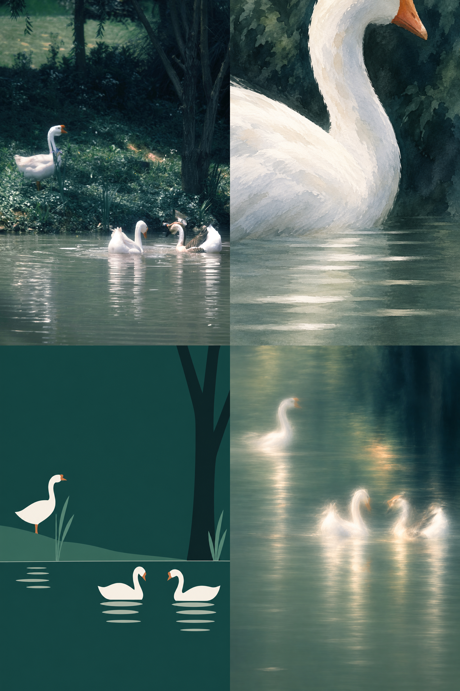
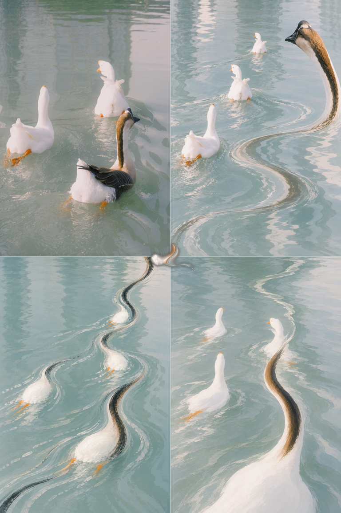

<div align="center">

# 【S.011】Starryear-Field丨星年·格域

**v1.2.3 · Four-panel Photo Distillation**

**把一张照片变成原图、局部放大、极简结构与梦幻余像。**


[](./LICENSE.md)
[](#)

</div>

---

## ⚠️ 声明

> **仅限个人学习、非营利研究与非商业创作。**
> 任何商业使用均须事先取得 Starryear年 的书面许可。
>
> 分享作品时，欢迎标注来源并 **@Starryear年**。

---

## 📖 关于本项目

这是一套从单张照片生成竖版 2×2 编辑艺术四拼的视觉工作流。四格位置与变化模式固定：左上真实原图裁切，右上抽象局部放大，左下简约结构提炼，右下梦幻光学余像。参考作品只提供变化语法，不提供题材与配色；每次作品的色调、光线、形态和主题都重新取自用户当前照片。三个生成格会先锁定同一组源图色彩角色，尤其避免左下格因过度图谱化而出现独立色偏，使四格先成为一件完整作品，再显现四种观看方式。

- ✅ 适配风景、建筑、植物、动物、静物与安静的纪实摄影
- ✅ 在留白、几何、墨迹、纸感与摄影质地之间自适应取舍
- ✅ 原图格只做等比缩放与裁切，不重绘、不调色、不修饰
- ✅ 后三格在缩略图下也必须创意机制各异，避免三张同质化抽象
- ✅ 四个单格均为竖版 2:3；按等大 2×2 拼合后，最终成品仍为竖版 2:3
- ❌ 不用于多照片拼贴、漫画分镜、普通九宫格或四种滤镜预览

> 📝 The Skill includes the complete prompt in both **Chinese** and **English**.

---

## 🖼️ 示例作品

<table>
  <tr>
    <td width="50%"></td>
    <td width="50%"></td>
  </tr>
  <tr>
    <td width="50%"></td>
    <td width="50%"></td>
  </tr>
</table>

> 示例只用于说明“现实证据 → 局部放大 → 极简结构 → 梦幻余像”的变化关系，不作为题材、配色或构图模板。

---

## 📋 目录

- [下载 Skill](#-下载-skill)
- [使用方法](#-使用方法)
- [可自由调整的部分](#-可自由调整的部分)
- [核心原则](#-核心原则)
- [内容结构](#-内容结构)
- [许可证](#-许可证)

---

## ⬇️ 下载 Skill

[下载「【S.011】 Starryear-Field丨星年·格域 v1.2.3」完整压缩包](./%E3%80%90S.011%E3%80%91%20Starryear-Field%E4%B8%A8%E6%98%9F%E5%B9%B4%C2%B7%E6%A0%BC%E5%9F%9F-v1.2.3.zip)

---

## 🚀 使用方法

### 方式一：作为 Codex Skill 使用

1. 将整个 `four-panel-photo-distillation` 文件夹放入 Codex skills 目录。
2. 开启新对话并上传一张拥有使用权的照片。
3. 提出需求：

   > 使用 `four-panel-photo-distillation` 把这张照片做成一张四拼编辑艺术作品。

4. Skill 会先确保四个单格逐一为竖版 2:3，再输出一张整体仍为竖版 2:3、明确为等大 2×2 结构的完成图。

### 方式二：作为提示词直接使用

| 语言 | 文件 |
| :---: | :--- |
| 🇨🇳 中文 | [references/four-panel-photo-distillation-prompt.zh-CN.md](references/four-panel-photo-distillation-prompt.zh-CN.md) |
| 🇬🇧 English | [references/four-panel-photo-distillation-prompt.en.md](references/four-panel-photo-distillation-prompt.en.md) |

---

## 🎛️ 可自由调整的部分

| 参数 | 说明 |
| :--- | :--- |
| **现实格裁切** | 位置固定在左上；可在不改像素的前提下调整等比缩放、裁切与主体落点。 |
| **抽象介质** | 可在纸本、墨、水彩、石墨、剪纸、稀疏矢量线与源图支持的模糊中选择一套主语言。 |
| **文字** | 默认无字；需要时最多加入一个短标题与一条微型索引，并确保拼写可靠。 |
| **色彩强度** | 忠实跟随源图的明度、饱和度、冷暖与透光感；不默认压灰或套米色纸感。 |
| **整体性色桥** | 固定一个主场域色、一个深色锚点与一至两个强调色；左下格至少复用其中两个角色，不单独另起配色。 |

---

## 💡 核心原则

1. **固定变化模式** — 四格依次承担原图证据、抽象局部放大、简约结构与梦幻余像，不能交换或退化为四个滤镜版本。
2. **同一视觉 DNA** — 至少三格共享源图的轮廓、轴线、间隔、材质或色彩证据。
3. **留白参与构图** — 降低密度，让空白承担节奏与张力，而非用装饰填满每格。
4. **整体先于单格** — 四格在明暗、疏密和写实程度上形成对角平衡，缩略图下仍像一件作品。
5. **原图像素锁定** — 现实格只能裁切与缩放，由脚本确定性拼合，不交给模型重画。
6. **创意机制分离** — 第二格负责“大与近”，第三格负责“少与准”，第四格负责“光与梦”；三格不能共用同一种构图和媒介效果。
7. **只借变化，不借题材** — 风格参考不得把自身的主题、色调、具体形状或装饰带入新作品。
8. **双重比例锁定** — Evidence 与三个生成格都必须是精确 2:3；四格等大拼合后的整体也必须是精确 2:3。
9. **左下色调归队** — 左下格可以最简约，但不能成为唯一偏冷、偏暖、偏灰或过饱和的象限；缩略图下如有拼贴感，只重做其配色而不破坏结构。

---

## 📁 内容结构

```text
four-panel-photo-distillation/
├── README.md
├── LICENSE.md
├── SKILL.md
├── agents/openai.yaml
├── scripts/assemble_quartet.py
├── references/
│   ├── four-panel-photo-distillation-prompt.zh-CN.md
│   ├── four-panel-photo-distillation-prompt.en.md
│   ├── style-grammar.md
│   └── source-contact-sheet.jpg
└── assets/examples/
    ├── 01-classroom-field.png
    ├── 02-orange-sphere-field.png
    ├── 03-geese-field.png
    └── 04-lotus-leaf-field.png
```

> `assets/examples/` 仅收录 Starryear年 明确认可的最终成品图，不放入参考图、测试图或临时输出。

---

## 📄 许可证

本项目采用 [LICENSE.md](./LICENSE.md) 中规定的使用条款。

---

<div align="center">

**如果这个项目对你有帮助，欢迎 Star ⭐ 支持！**

</div>
